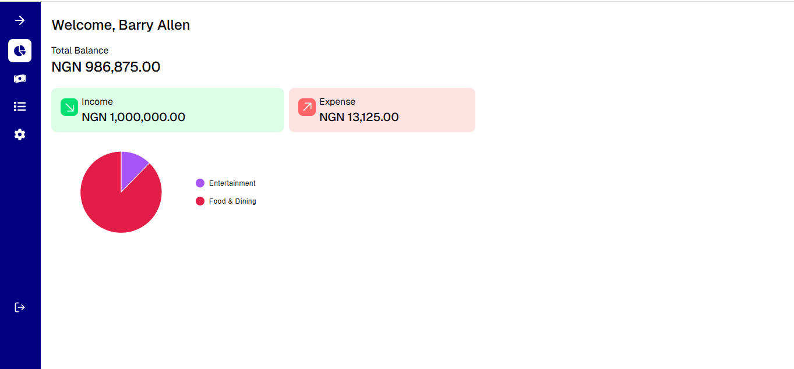
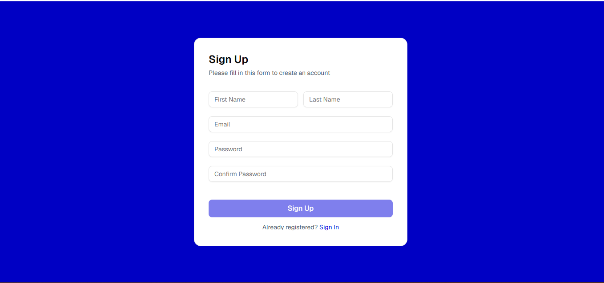
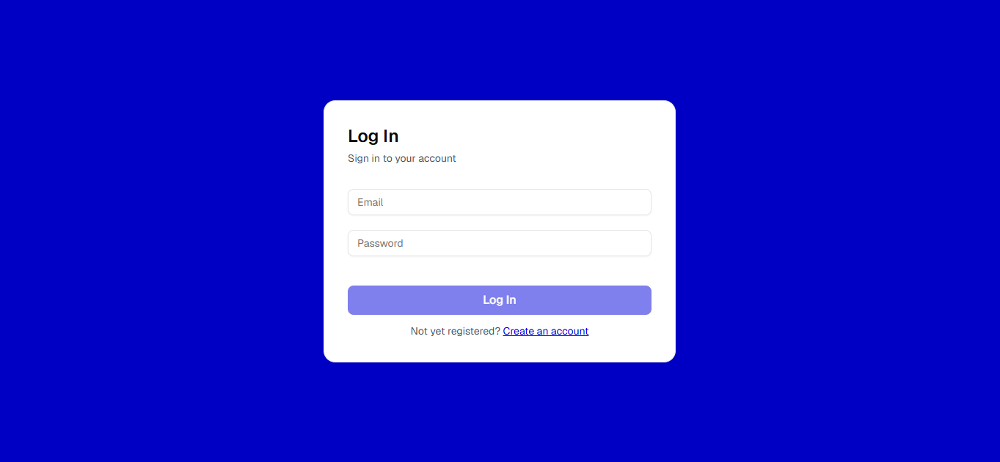
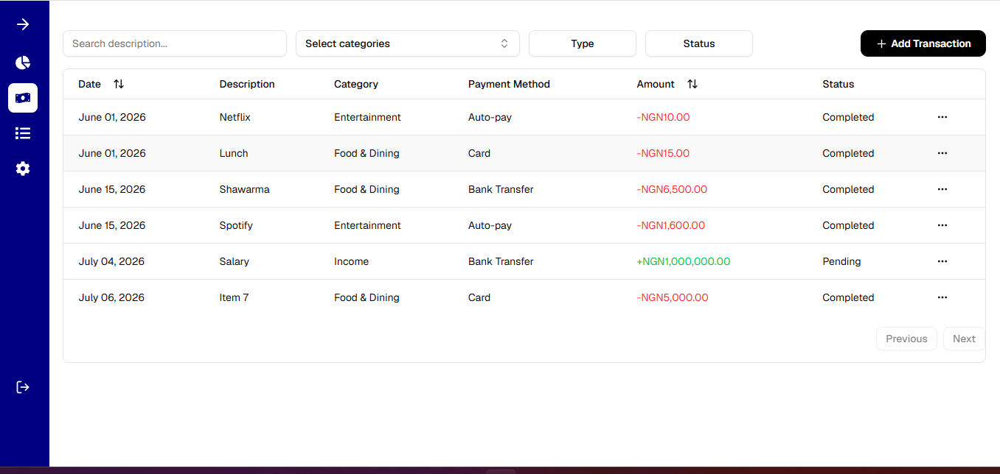
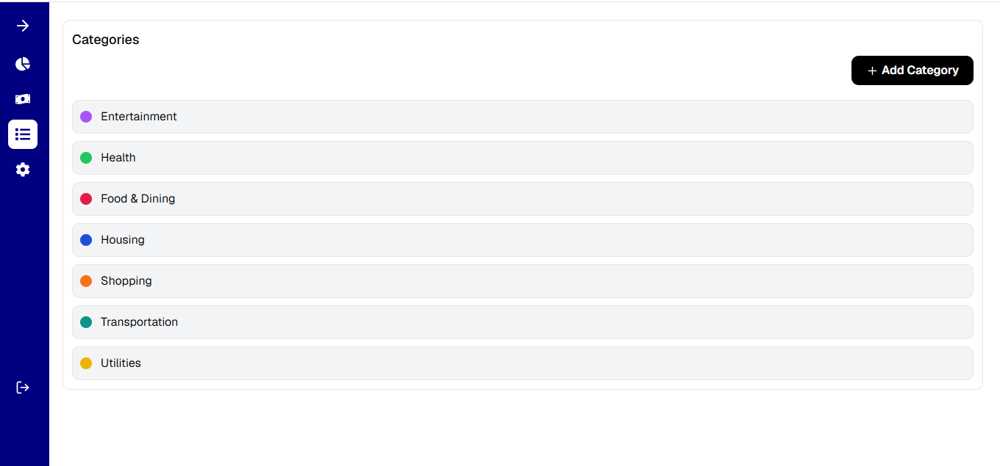
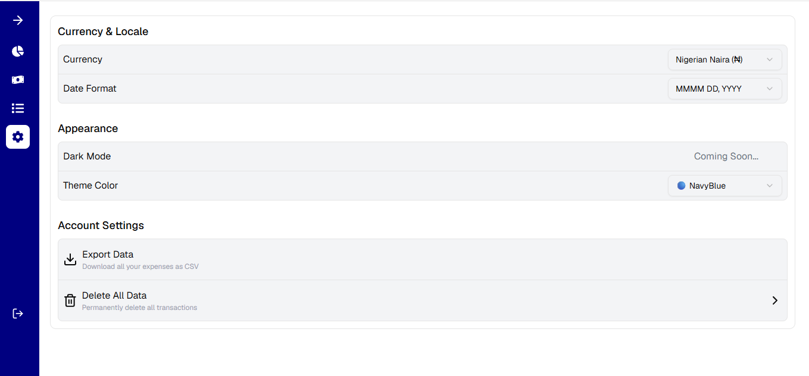

# Expense Tracker

A full-stack personal finance application built with Next.js and Supabase that helps users manage income, expenses, and categories through an intuitive dashboard with real-time analytics.

**Live demo:** https://expense-tracker-lime-nu-67.vercel.app

## Features

- Email/password authentication with protected routes (unauthenticated users are redirected to `/login`)
- Add, edit, and delete transactions (type, category, amount, payment method, status, date)
- Transactions table with debounced search, multi-select category filtering, date/status filtering, sorting, and pagination
- Custom categories with a 21-color picker
- Dashboard with income/expense totals and a category breakdown pie chart
- Per-user settings: currency (15 supported), date format, and theme color, all reflected across the app
- Confirm-before-delete flow using toast notifications
- Fully responsive layout

## Tech Stack

| Layer              | Tools                                               |
| ------------------ | --------------------------------------------------- |
| Framework          | Next.js 16 (App Router), React 19                   |
| Styling / UI       | Tailwind CSS 4, shadcn/ui (Radix UI), Framer Motion |
| Forms & validation | TanStack Form, Zod                                  |
| Data & state       | TanStack Table, Zustand                             |
| Charts             | MUI X Charts, Recharts                              |
| Backend            | Supabase (Postgres + Auth), Next.js Server Actions  |
| Other              | Sonner (toasts), date-fns                           |

## Screenshots and Videos

<iframe
  src="https://player.cloudinary.com/embed/?cloud_name=dh4gfd8ey&public_id=2026-07-0614-35-00-ezgif.com-video-to-gif-converter_t4jxov"
  width="640"
  height="360" 
  style="height: auto; width: 100%; aspect-ratio: 640 / 360;"
  allow="autoplay; fullscreen; encrypted-media; picture-in-picture"
  allowfullscreen
  frameborder="0"
></iframe>

<p align="center">
  
  
</p>

<p align="center">
  
  
</p>
<p align="center">
  
  
</p>

## Getting Started

### Prerequisites

- Node.js 18+
- A [Supabase](https://supabase.com) project

### Installation

```bash
git clone https://github.com/larrywebdev/expense-tracker.git
cd expense-tracker
npm install
```

### Environment variables

Create a `.env.local` file in the project root:

```
NEXT_PUBLIC_SUPABASE_URL=your-supabase-project-url
NEXT_PUBLIC_SUPABASE_PUBLISHABLE_KEY=your-supabase-publishable-key
```

### Database setup

This project expects three tables in your Supabase project:

- **`expense-tracker-transactions`** — `id, type, category, amount, status, payment_method, description, date, user_id`
- **`expense-tracker-categories`** — `id, user_id, label, color`
- **`expense-tracker-user-settings`** — `user_id, currency, date_format, theme_color`

Enable Row Level Security and scope each table to the authenticated `user_id`.

### Run locally

```bash
npm run dev
```

Open [http://localhost:3000](http://localhost:3000) in your browser.

### Other scripts

```bash
npm run build   # Production build
npm run start   # Run production build
npm run lint     # Run ESLint
```

## Project Structure

```
app/
  (auth)/login, (auth)/signup   # Public auth routes
  (main)/dashboard              # Overview + charts
  (main)/transactions           # Transactions table + CRUD
  (main)/categories             # Category management
  (main)/settings               # User preferences
components/                     # Shared UI components
lib/
  data-service.js                # Server actions (CRUD)
  schema/                        # Zod validation schemas
  supabase/                      # Supabase client + session handling
store/                          # Zustand stores
```

## Author

Larry

GitHub: https://github.com/larrywebdev

## License

No license specified yet.
